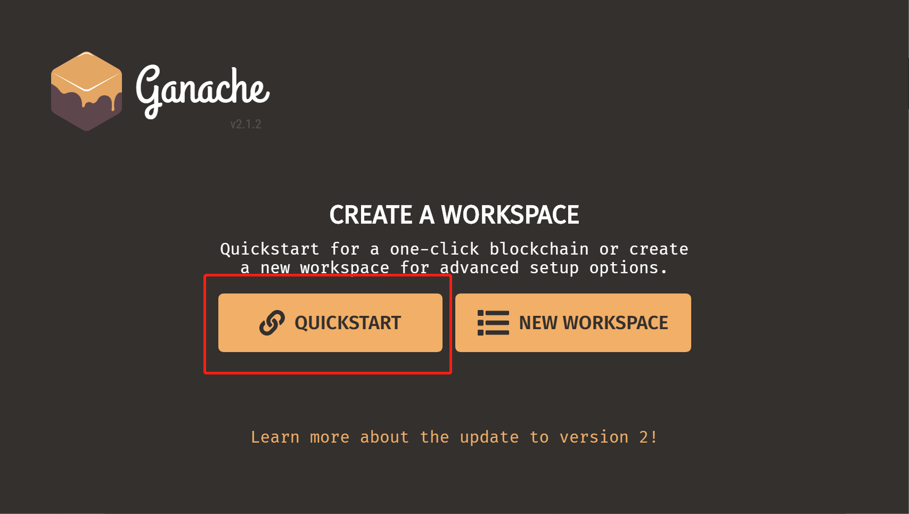
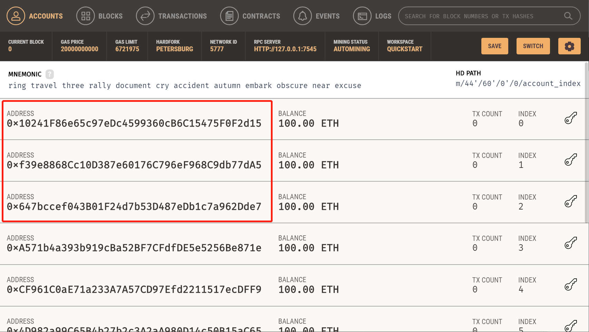
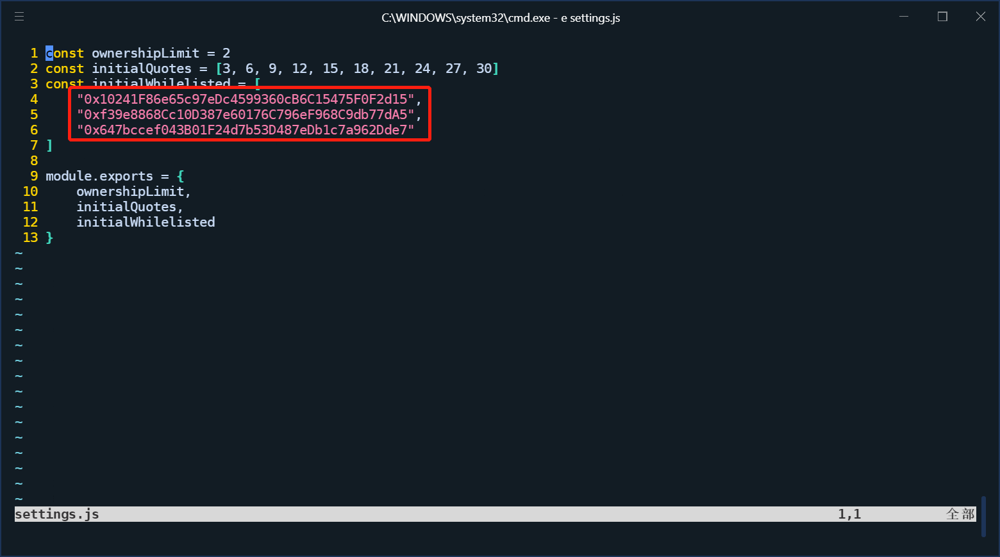

# ResAloc

> A simple decentralized resource allocation system, with truffle-suite and vue.js.

## Guide

**Step 1: Install MetaMask**

[MetaMask](https://metamask.io/) is a browser extension that support both Chrome, Firefox, and other modern browsers. It is an Ethereum wallet system that provides functionalities for managing Ethereum accounts and  handling transactions. This Dapp require MetaMask to make interact with Ethereum blockchain, so please first [install MetaMask](https://chrome.google.com/webstore/detail/metamask/nkbihfbeogaeaoehlefnkodbefgpgknn) in your browser. 

**Step 2: Install Ganache**

[Ganache](https://www.trufflesuite.com/ganache), part of [Truffle suite](https://www.trufflesuite.com/), provides a personal blockchain environment for Ethereum development. For dev and test purpose, we use Ganache as the Ethereum network where our smart contracts will be deployed to. Just install Ganache and use the "quickstart" workspace, and then [switch MetaMask network to the local Ganache network](https://www.trufflesuite.com/docs/truffle/getting-started/truffle-with-metamask#setting-up-metamask).



**Step 3: Build and setup**

Go to our Github repo, download project code and install dependencies.

```bash
# download project code
git clone https://github.com/qige96/7CCSMDLC.git

# install dependencies
npm install
```

Setup initial accounts (only these accounts are allowed to make transactions).



copy and past these addresses to  `settings.js`



Deploy contracts and build front-end interface.

```bash
# deploy smart contracts
npx truffle migrate

# build front-end app at 127.0.0.1:8080
npm run dev
```

---

 Now you can see whether you can play with the system. More docs, please refer to [docs](./docs) or [wiki](https://github.com/qige96/7CCSMDLC/wiki).