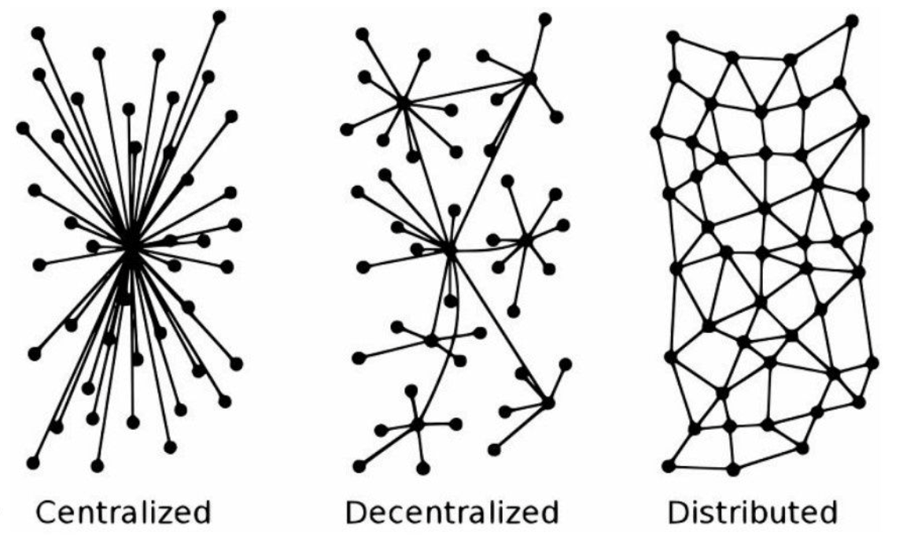
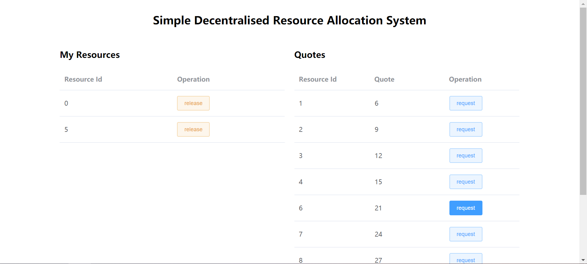
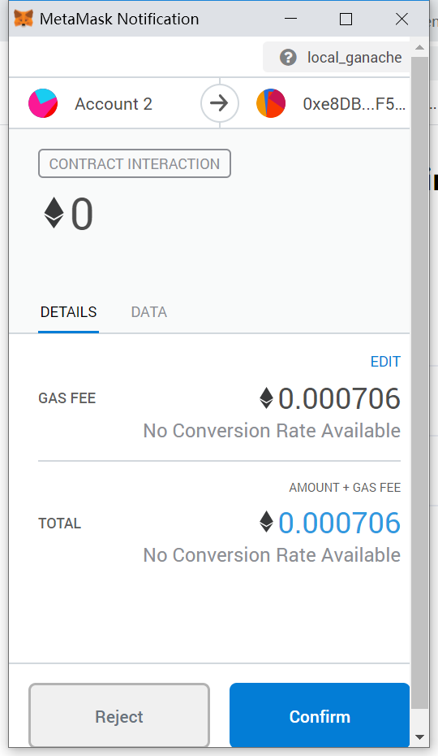

# A Decentralized Resource Allocation System

[toc]

### Abstract

Resource allocation is a commonly seen task. Typical cases are module selection, or labor division and allocation. This report first describes one widely used resource allocation model implemented by centralized architecture, followed by its weakness, and then propose a decentralized improvement by blockchain technology.

## Introduction

#### A resource allocation model

One process for resource allocation task is that, initially users claim their request, and then users could get the resources they needed if there are enough resource, or otherwise resources would be randomly allocated to users demanded. After that users could release the resources they don't want any more, and compete for spare resources, usually in a "First Come First Serve" order.

Often this model implemented by a centralised client-server architecture. Inherently it has some weakness. First of all, allocation results might be manipulated by central authority. And from the technical perspective, Dos attack to the central server, or burst traffic, is always an annoying problem.

We could improve the model above by blockchain technology. Since blockchain is a decentralized architecture, the weakness inherited from C/S architecture would be solved naturally. 

## Background

Blockchain is essentially a decentralized distributed ledger database. In more detail, blockchain is an open data chain which contains encryption processing packets connected end to end and is continuously extended. Each block contains some public basic information. For example, the overall hash value, timestamp, and text content of the last block data connected to itself.

Blockchain operates in a peer-to-peer network, and are designed to have inherent tamper-resistant properties. If someone attempts to modify the data in one block on the chain, he must also modify all the data items (transactions) recorded after that data item. And it needs to be recognized by the majority of nodes in the network, otherwise any modification will invalidate the chain. 

### Decentralization

One of the most important features of blockchain is decentralization. In a system with many nodes, each node has the characteristics of a high degree of autonomy. Nodes can be freely connected to each other to form new connection units. Any node may become a phased center, but it does not have a mandatory central control function. The influence between nodes will form a nonlinear causal relationship through the network. This kind of open, flat and equal system phenomenon or structure is called decentralization.

Decentralization is not the absence of the center, but the free choice of the center and the free determination of the center by the nodes. To put it simply, centralization means that the center determines all other nodes. All other node must rely on the center, and the nodes cannot work normally without the center.



In the decentralized system, all node are equal, or any node can become a center. Any center is not permanent, but phased, and any center is not mandatory for nodes.

### Benefits of Decentralization

The benefits of decentralization are reflected in two aspects. For one hand, it reduces the security risk of the network. For example, all data in a centralised system is stored in a central node. Once the hacker attacks the central node, it can destroy the entire network. However, in a decentralised system, because the network is maintained by all nodes, even if a few nodes have problems, it will not cause a great impact.

For another, it is to decentralize the power of the centralized company, avoid the emergence of data monopoly, and ensure the information privacy of users. So, to some extent, decentralization could protect freedom and quality of the Internet world.

We are going to to develop a decentralised resource allocation system. The whole system is developed on Ethereum, because Ethereum encapsulates all the underlying technologies needed for block chains, such as digital signature, workload proof, mining packaging, etc. On this powerful platform, we only need to focus on the logic of the application.

### Relationship between Ethereum and Blockchain

A blockchain is actually a decentralized database ledger, a data block generated using a series of cryptographic associations. One of the most representative applications is the well-known bitcoin. The technology has the characteristics of decentralization, untamperability, openness and so on.

Generally speaking, the architecture of blockchain is divided into data layer, network layer, consensus layer, incentive layer, contract layer and application layer from bottom to top. Its core content should be the use of asymmetric encryption algorithm, consensus algorithm and so on. The obvious point of this technology lies in its high degree of untamperability and so on. At present, many innovative and creative companies are carrying on the commercial application of blockchain. However, blockchain technology also faces some shortcomings such as high energy consumption.

Ethereum is an open source public block connection platform with intelligent contract function. It processes peer-to-peer contracts by a decentralized Ethernet virtual machine through its dedicated cryptocurrency Ethernet coin (Ether, referred to as "ETH").

Smart contract is the core concept of Ethereum. A smart contract is an automatic agent living in the ethernet system, who has his own Ether address. When the user sends a transaction to the address of the contract, the contract is activated, and then according to the additional information in the transaction, the contract runs its own code and finally returns a result, which may be another transaction from the address of the contract. It should be pointed out that the transactions in Ethereum are not only sending Ethers, they can also carry a lot of additional information. which may be quite important because the contract will complete its business logic based on this information.

The business that smart contract can provide is almost endless, because smart contracts living in Ethereum are written by nearly Turing's complete languages like Solidity, which provide complete freedom for users to build a variety of applications. The Ethereum white paper gives several examples, such as savings accounts, user-defined sub-currencies, and so on.

## Design

At the first section, we describe a typical centralised resource allocation model, and discuss its weakness inherit from the centralised architecture. Here we present a blockchain based decentralised solution to improve this model.

### Improvement by blockchain

At the first section, we describe a typical centralised resource allocation model, and discuss its weakness inherit from the centralised architecture. Here we present a blockchain based decentralised solution to improve this model.

At the first stage, users claim and broadcast their requests. After deadline of the first stage, the system collect all the requests and allocate resources according to the resource quote list: if enough then allocate the resources to the user who needed, or otherwise randomly. This first stage don't adopt the "Fist Come First Serve" principle because that might result in severe competition among all users and thus network congestion. the result of the first stage become the genesis block. 

At the second stage, users can release resource they don't want any more, by submitting a release transaction. Also they can submit a request transaction, in this stage "Fist Come First Serve" principle is adopted. Each time a node mines a block, it will organize the transactions (both release and request) in a sequential order, and does addition and subtraction on resources quotes. Valid transactions will be accepted into blocks, while invalid transactions will be abandoned. The Request an Release operations form the backbone of this allocation model. Furthermore, we can add more features into this system, such as limiting the number of resources a user could hold, or adding resource exchange functions. 

### Requirements

Now what we need is a decentralised resource allocation system. Here are the basic requirements for this system :

1. System administrator could set resources available to allocate and their quotes during initialisation.
2. System administrator could set permissions for specific users to participate in an allocation event during initialisation.
3. System administrator could dynamically change resources quotes and user permissions after initilisation.
4. System administrator could set maximum number of resources for users, e.g. every user could only hold no more than 4 resources . 
5. Users could apply or withdraw for a  certain resource during the first allocation stage.
6. At the end of the first allocation stage, the system collect all the user resources applications, and for each kind of resources, allocate them  in the following rule: if resources enough then allocate the resources to the user who needed, or otherwise randomly allocate them to applicants.
7. Users could request or release resources during the second allocation stage.

### Conceptual Framework

#### States

The system need to maintain four core data structure. First is the permission array of user accounts. Only accounts in this array should have the permission to participate in allocation events. Second is the resources quote map from resource id to its quote. Third is the resources application map from user account to an array of resource id they need. This map is used for the first stage. Forth is the resources ownership map from user account to an array of resource id. This map records resource ownership of each user in the second stage.

There are more states to be maintained, such as maximum resources for users.

#### Operations

The system should also provide several operations:

1. Constructor. This is the deployment and initialisation operation to launch an allocation event. Only system administrator could perform this operation.
2. Apply. Users use this operation to express their need for a resource in the first stage.
3. Withdraw. Users use this operation to withdraw their application for a resource in the first stage.
4. Initial Allocate. System administrator perform this operation at the end of the first stage to trigger initial resources allocation.
5. Request. Users use this operation to request a resource. If there are available resources in the system, the user could obtain the needed resource at once.
6. Release. Users use this operation to release the resource they don't need any more.

There are more operations needed, such as query operations for resources quote, current user ownership, etc. 

## Implementation

### System Overview

The whole system consists of two main parts: the contracts living on Ethereum, and the web app serve as user interface. At the beginning, system administrators deploy and initialise smart contract on certain Ethereum network. After that, users could interact with the contract via client software with a Ethereum wallet, typically a web app client written by HTML, CSS and JavaScript.

#### Smart Contracts

In this system, smart contracts take the responsibility of storing data and`handling business logic. The blockchain platform we use, Ethereum, support multiple language for writing smart contracts, such as Solidity, Vyper, Bamboo, Flint, and so on. In this project, we use the JavaScript-like language, Solidity, to implement our smart contracts, because it is currently the most popular development language for Ethereum decentralised applications (Dapp), so that we could easily get support from many useful third party libraries online.

The contract part in this system has mainly two contract files, corresponding to the two stages in our resources allocation model. Below are the simple API design for the two files. For the complete code, please refer to Appendix.

**Contract API for first-stage.sol**

```javascript
// File: FirstStage.sol 

pragma solidity >=0.4.20 <=0.6.0;

import "github.com/OpenZeppelin/openzeppelin-contracts/blob/release-v2.5.0/contracts/access/roles/WhitelistedRole.sol";

contract FirstStage is WhitelistedRole {

    // quotes of all resources, the index of the array represents the Id of that resource
    uint[] private quotes; 
    // resource ownership of alll users
    mapping(uint => mapping(address => bool)) internal resApplication;
    // resource resApplication limit for every users, 4 by default
    uint ownershipLimit = 4;
    // user accounts allowed to participate in this event
    address[] public allowedUsers;
    // falg to indicate if initial allocation has been executed
    bool private allocationExecuted = false;
    // result for initial allocation
    mapping(address => uint[]) alloc;

    /// @dev initialise and deploy the contrat
    /// @param _limit - maximum resource holding for each user
    /// @param _initQuotes - initial reosurces quotes
    /// @param _whitelisted - accounts allowed to participate in this event
    constructor (uint _limit, uint[] memory _initQuotes, address[] memory _whitelisteds) public ;
    
    /// @dev request resource from system
    /// @param _resId  unsigned integer - the Id of the resource wanted
    /// @return _success bool - success status of this transaction
    function applyFor(uint _resId) public onlyWhitelisted notAllocated returns (bool _success) ;
    
    /// @dev release resource to the system
    /// @param _resId  unsigned integer - the Id of the resource to be released
    /// @return _success bool - success status of this transaction
    function withdraw(uint _resId) public onlyWhitelisted notAllocated returns (bool _success) ;
    
    /// @dev query my resources 
    /// @return array - tell what resources I have had
    function viewMyApplication() external view returns (bool[] memory);
    
    /// @dev initial allocation
    function allocate() notAllocated public;
    
    /// @dev obtain result of initial allocation
    /// @return array - initial allocation result for a specific user
    function viewAllocationResult(address _user) view external returns (uint[] memory);
    
}
```

**Contract API for second-stage.sol**

```javascript
// File: SecondStage.sol

pragma solidity >=0.4.20 <=0.6.0;

import "github.com/OpenZeppelin/openzeppelin-contracts/blob/release-v2.5.0/contracts/access/roles/WhitelistedRole.sol";

contract SecondStage is WhitelistedRole {

    // quotes of all resources, the index of the array represents the Id of that resource
    uint[] private quotes; 
    // resource ownership of alll users
    mapping(address => mapping(uint => bool)) internal ownership;
    // resource ownership limit for every users
    uint ownershipLimit = 4;

    /// @dev initialise and deploy the contrat
    /// @param _limit - maximum resource holding for each user
    /// @param _initQuotes - initial reosurces quotes
    /// @param _whitelisted - accounts allowed to participate in this event
    constructor (uint[] memory _initQuotes, address[] memory _whitelisteds) public ;
    
    /// @dev request resource from system
    /// @param _resId  unsigned integer - the Id of the resource wanted
    /// @return _success bool - success status of this transaction
    function request(uint _resId) public onlyWhitelisted returns (bool _success);
    
    /// @dev release resource to the system
    /// @param _resId  unsigned integer - the Id of the resource to be released
    /// @return _success bool - success status of this transaction
    function release(uint _resId) public onlyWhitelisted returns (bool _success);
    
    /// @dev query the quote of all available resources 
    /// @return _allQuotes array - current quote of all resources
    function viewAllQuotes() external view returns (uint[] memory);
    
    /// @dev query my resources 
    /// @return _myResources array - tell what resources I have had
    function viewMyResources() external view returns (bool[] memory);
    
}
```

During development, there are some points worth noticing. 

- Random number. It is a very difficult problem to create random numbers for smart contract living in a blockchain. Currently the state-of-the-art solution is to use an "oracle" outside of blockchain to generate random numbers for smart contracts. In out project, we adopt a simple approach to generate pseudo-random numbers: hash the time and mod upper bound number.

  ```js
  function randint (uint _min, uint _max) public view returns (uint) {
      bytes memory rand = toBytes(now);
      return uint(keccak256(rand)) % (_max - _min) + _min;
  }
  ```

  It should be pointed out that this approach is not a safe solution, so industrial product would not use this method. 

- Passive triggering. One feature of smart contract in blockchain is that it will  execute only when somebody triggers it, or otherwise it will never execute. Because of that, some functionalities in ordinary programs are difficult or maybe impossible to implement in smart contracts. For example,  it is a common task to set timed tasks that will be executed automatically when it hits the time. Yet this simple task cannot be implemented in our Dapp. Thus, at the end of the first stage, system administrators are required to manually execute the initial allocation job. 

#### Web App Client

Client software served as a user interface. To simplify usage and improve user experience, client software should be able to hide low level complex operations, like encoding, signature, and verification from ordinary users. There could be various forms of client software, and web app is currently the most popular and convenient form.

One thing to be noted is that, "smart contract + client software" is also a kind of Client/Server architecture, but it is not centralised because in the server side is not one central server, but a set of server nodes that provide identical services. In fact, one could run the Ethereum environment on his own computer, so that his own computer become a server node that maintain the blockchain together with other nodes in the network.



In our system, we embed a third party software, MetaMask. MetaMask is a browser extension that support both Chrome, Firefox, and other modern browsers. It is an Ethereum wallet system that provides functionalities for managing Ethereum accounts and handling transactions. 



With the help of MetaMask, we could safely ignore the low level technical issues, and focus on business logic, and interaction experience.

## Running Example

In this section, I am going to describe a typical use case, i.e. module selection in universities, from deployment, initialization, to transaction.

In UK universities, module selection may follow a fine tuned, non-competitive algorithm. For example, individual project allocation system requires students rank their preferences for a list of candidate projects, and supervisors rank their preferences for interested students. Then the system may perform some calculation and try to find best matches for students and projects. Nevertheless, more universities around the world, like in Mainland China, adopt the allocation model described earlier, and students suffer from the centralised architecture for years. Mostly, the central server crashes for bulged requests because of competitive allocation mechanism (stage 2 of the allocation model). Some students may be confronted with unfair competition because others may use macro scripts to automate and speed up request process. In this case, our decentralised solution could help solve these problems.

At the beginning, administrators should obtain relative statistics, like what and how many modules would be available for this semester, how many students would participate in this module selection (allocation) event, etc. Then administrator launch a module allocation event, by initialising the contract with initial parameters, including student accounts, module quotes, and max holding for each students, and deploying it to an Ethereum network. Next, administrator send specific accounts to every students, and inform them that the first stage of the module allocation process start. 

After that, students begin to express their intent to interested modules, by submitting applications. When it hits the deadline, administrators end the first stage, by manually triggering the contract to perform initial allocation. During this operation, the system collects all the students' intent to their interested modules, and check the module quotes: if their are more modules than respective applicants, then the system directly allocate all modules to these applicants. Otherwise, the system randomly allocate all modules to some of the respective applicants. Then the allocation process enters the second stage, when students could request for still available modules in the system, or release the modules that are not wanted any more. When it hits the deadline, administrators transfer the final result on the blockchain to central database, and thus the whole module selection process ends. 

## <s>Why this works?</s>

<s>Combined with mechanism of blockchain to explain the usefulness of this system.</s>

## Conclusion

In this report, we  proposed a decentralised resource allocation system. We started with describing a centralised  resource allocation model, and discussing its drawbacks: manipulation by central authority, vulnerability to DoS attack, and so on. To solve these problems, we proposed a decentralised system architecture using blockchain technologies. Next, we analysed project requirements and present a draft of system design. We implemented this system on the famous blockchain development platform Ethereum, with a Web App as the user interface. We also went through this decentralised model with a university module selection example. Our system is still a prototype, but we believe that our solution could be effective in solving those problems in the real world.

