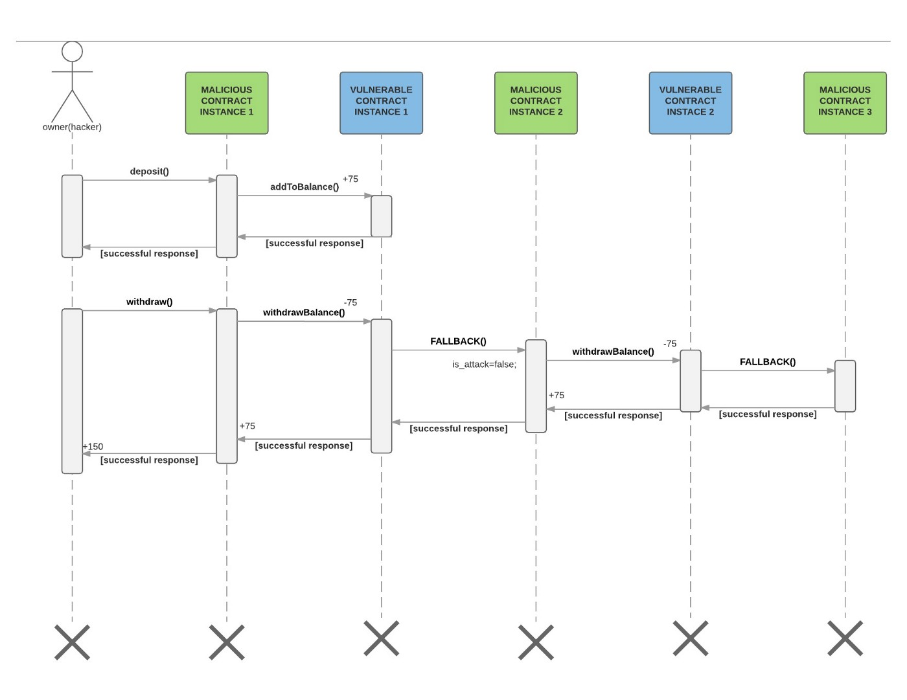

> [!WARNING]
> most of these answers are copied from online texts!

### Chapter 2

**List the sequence of events involved in acceptance of new blocks by nodes.**

1. Nodes get a new block from other nodes
2. Nodes check for validity and accept (or not-accept) the block
3. Accepted blocks are linked into the main chain. If competing chains exist,
   nodes accept the chain with the most PoW.
4. Nodes send this block to other nodes in the network

**Describe the mathematical problems used in Bitcoin for PoW.**

The mathematical problem used in Bitcoin for PoW is to find a value for the *Nonce* that results in a block header hash that is less than the target, after constructing the block header and initialize the *Nonce* field to zero. Since it is impossible to infer out this *Nonce* value, miner nodes can only adopt a trial-and-error approach to test billions or trillions of nonce values before a nonce is found that satisfies the requirement.

**What is the total maximum number of Bitcoin to be issued? How many have been issued so far? What will miners be paid after the maximum is reached?**

1. The total maximum number of Bitcoin to be issued is around 21,000,000 bitcoins. In the beginning, a miner would be rewarded with 50 bitcoins when it mines a block. Every 210000 block the reward would be halved. Easily see that the reward would finally become zero. So the total amount of bitcoin could be mined is
   
   50 * 1 * 210000 + 50 * (1/2) * 210000 + ...+ 50 * (1/2^n) * 210000 
   =50 * 2 * 210000 = 21000000
   
2. Currently (05/2020), it is estimated that about 18.35 million bitcoins have been issued.

3. After the maximum is reached, miners would only be paid with transaction fee.

**What is a wallet? What is the difference between wallets held on personal machines versus wallets held on an exchange?**

1. At a high level, a wallet is an application that serves as the  primary user interface. The wallet controls access to a user’s money,  managing keys and addresses, tracking the balance, and creating and  signing transactions. More narrowly, from a programmer’s perspective, the word "wallet"  refers to the data structure used to store and manage a user’s keys.
2. Wallets held on personal machines give full control to the wallet owner: only the owner have access to the private keys. However, the private keys in wallets held on an exchange are stored on the server of the exchange, which means the exchange can access, or even take over all the private keys. Thus, wallets held on personal machines are more secure than wallets held on an exchange.

**What are the hash functions SHA256 and RIPEMD160?**

Hash functions are a group of one-way functions that produce a fingerprint or "hash" of an arbitrary-sized input. It is relatively easy to compute the hash of an input, but extremely difficult to figure out the input of a hash.

SHA256 means Secure Hash Algorithm that generate a hash result of 256bits. RIPEMD160 means RACE Integrity Primitives Evaluation Message Digest that generate a hash result of 160 bits. They are widely acknowledged cryptographically secure hash algorithms.

### Chapter 3

**Create a table of the advantages and disadvantages of the major consensus protocols**

1. PoW
2. PoS
3. PoA
4. Turn-taking protocols

| Protocals | Advantages                                                   | Disadvantages                                                |
| --------- | ------------------------------------------------------------ | ------------------------------------------------------------ |
| PoW       | highly scalable                                              | cause huge energy consumption; vulnerable to a “51% attack”  |
| PoS       | faster processing of transactions; Consumes less energy; Doesn’t demand for equipment | Initial distribution problem; Validators signing competing blocks; Cartel Problem; Finality Problem |
| PoA       | faster processing of transactions; Consumes less energy; Doesn’t demand for equipment | Only used in permissioned chain                              |
| PoET      | less resource consumption                                    | Reliance on Intel; Hardware requirement                      |

**What was the software bug which caused a long internal fork in Bitcoin in March 2013? How was it resolved?**

A bitcoin miner running version 0.8.0 created a large block (at height 225,430) that is incompatible with earlier versions of Bitcoin. This was caused by the migration from BerkeleyDB  to LevelDB, which accidentally removed an unknown 10,000-BDB database  lock limit. The result was a block chain fork, with miners, merchants and users running the new version of bitcoin accepting, and building on, that block, and miners, merchants and users running older versions of bitcoin rejecting it and creating their own block chain.

To resolve it, large mining pools running version 0.8.0 were asked to switch back to version 0.7, to create a single block chain compatible with all bitcoin software.

**Explore the vulnerability of the Polkadot / Parity ICO. What was the problem? What are the possible solutions?**

According to Parity, the vulnerability was triggered by a regular user  who attempted to exploit a flaw in the source code, accidentally  removing crucial library code in the process(这就很操蛋，一个用户的操作影响了整个网络). The [Polkadot](https://polkadot.io/) ICO took the heaviest hit, holding over $92 million in Ether in a now frozen wallet. Possible solution may be a hard fork to create revert back the chain.

### Chapter 5

**What was the vulnerability in the DAO exploitation? Explain how recursive code enabled the vulnerability to be exploited**

> see [this post](https://medium.com/@MyPaoG/explaining-the-dao-exploit-for-beginners-in-solidity-80ee84f0d470)

The vulnerability came from the **Fallback function**. A contract can have one anonymous function, known as well as the fallback function. This function does not take any arguments and it is triggered in three cases:

1. If none of the functions of the call to the contract match any of the functions in the called contract.
2. When the contract receives ether without extra data.
3. If no data was supplied.

When sending money to another contract, the call function has a set amount of [gas](http://ethdocs.org/en/latest/contracts-and-transactions/account-types-gas-and-transactions.html#what-is-gas) but no data (case b below), and thus, triggers the fallback function of the called contract.

The hacker initiates the interaction with contract Bank through its  malicious contract and the sequence of the actions is as follows:

1. The first thing the hacker does is send ether (75 wei) to the vulnerable contract through the *deposit* *function* of the malicious contract. This function calls the *addToBalance function* of the vulnerable contract.
2. Then, the hacker withdraws, through the *withdraw function* of the malicious contract, the same amount of wei (75), triggering the *withdrawBalance* *function* of the vulnerable contract.
3. The *withdrawBalance function* first sends ether (75 wei) to the malicious contract, triggering its fallback function, and last updates the *userBalances* variable (that this piece is done last is very important for the attack).
4. The malicious fallback function calls the *withdrawBalance* *function* again (recursive call), doubling the withdraw, before the execution of the first *withdrawBalance function* finishes, and thus, without updating the *userBalances* variable.

### Chapter 6

**Articulate a system design for the Case Study problem.**

**Consider Facebook’s proposed Libra cryptocurrency. Starting with the Libra Whitepaper, explain the technical architecture of the Libra Blockchain:**

Libra adopts an account-based model similar to Ethereum, which means that users can transfer digital assets from one account to another, by submitting transactions. 

The machine nodes in the Libra network are called Validators, who interact with user clients, handle transactions, and form the Libra blockchain together with other peers. 

The consensus protocol used for Validators in Libra network to reach agreements upon transactions is called LibraBFT, a kind of turn taking protocol, which indicates the nodes in the network would take turns to pack a block of transactions and append them to the Libra blockchain (with agreement of other nodes).

The Libra blockchain, unlike Bitcoin, Ethereum or other blockchain application, is essentially a Merkle accumulator (append-only Merkle tree), instead of a linked list of blocks. 

### Learning Outcome

**What is the role of consensus protocols in distributed systems?**

A fundamental problem in distributed systems is to achieve overall system reliability in the presence of a number of faulty/malicious nodes. This often requires nodes in the system to agree on some data value that is needed during computation. Consensus protocols could be used as rules for nodes to reach agreements.

**What are the inherent trade-offs between consistency, availability and partition-tolerance (CAP), and be able to state the CAP Theorem?**

> see relative [wikipedia page](http://en.wikipedia.org/wiki/CAP_theorem)

Consistency means that all clients see the same data at the same time, no matter which node they connect to. Availability means that that any client making a request for data gets a response, even if one or more nodes are down.  Partition-tolerance means that the cluster must continue to work  despite any number of communication breakdowns between nodes in the  system.

CAP Theorem states that  it is impossible for a distributed data store to simultaneously provide more than two out of the three guarantees among Consistency, Availability, and Partition-tolerance. 

Since no distributed system is safe from network failures, thus network partitioning generally has to be tolerated. Therefore, usually one has to make trade-offs between consistency and availability.

**What are economic consensus protocols?**

Consensus protocols that are economic? that not cost so much money, time, and energy?

**What are the concepts of a distributed ledger (or blockchain), permissioned and non-permissioned ledgers, mining, proof-of-work and proof-of-stake, and smart contracts?**

- **Distributed ledger** means a digital system in which records of transactions are simultaneously maintained at multiple computing nodes throughout a network.
- **Permissioned and non-permissioned ledgers**. Permissioned ledgers are  ledgers whose participants are preselected or subject to gated entry on satisfaction  of certain requirements, while non-permissioned ledgers are ledgers where anyone could participate in. 
- **Mining** is the process for nodes in blockchain network to validate new transactions and record them on the global ledger.
- **Proof-of-work** is a consensus protocol for nodes in a blockchain network to compete for the right to pack transactions into a block, by solving hard mathematical problems. 
- **Proof-of-stake** is a consensus protocol for nodes in a blockchain network to compete for the right to pack transactions into a block, by depositing a financial stake.
- **Smart contracts**, traditionally were defined as a set of promises, specified in digital form, including protocols within which the parties perform on the other promises. Nowadays they indicate computer programs that run in the context of  Ethereum Virtual Machine or other blockchain VMs.

**What are the applications of cryptography and encryption to distributed ledger technologies?**

> see this [post](https://medium.com/catalystnetorg/cryptography-for-distributed-ledger-technologies-in-a-nutshell-dc25e4aa4eb7)

- The linking of each block in the blockchain through the use of a hashing function output (hash) allows the formation of an immutable series of  events, allowing the traceability of the movements of assets from one  block to the next while knowing the chronological order in which they  occurred.
- Thereby, hashing functions can be used to generate compressed data structures like **Merkle trees** to store information within the block.
- They are also utilised in the **Proof of Work** algorithm, which is for a majority of blockchains the **network management engine**, i.e. how nodes on the network gain consensus for the state for a given set of processed transactions.
- Asymmetric encryption also helps. Within a decentralised environment where there is no central authority  to control and ensure transaction validity every transaction broadcast  to the network must contain a valid signature created by one's private key. Through the use of signature schemes, a user can  verifiably prove that he, in fact, own the funds that he is declaring a transaction for.
- Every transaction submitted by a sender contain a public key of the receiver. Only the person who holds the corresponding private key can prove that he is the actual receiver of that transaction.

**How distributed ledgers can be used to implement cryptocurrencies?**

To implement cryptocurrencies with distributed ledgers, there are two core things to do. Firstly, make all the transactions immutable. This could be doe by combining all the transactions to produce a hash value, so that we can easily check if any transaction had been altered. Secondly, design a mechanism for transferring ownership of currency. This could be done using asymmetric encryption. Only the person who has the private key can claim ownership and proceed the digital assets he owns.

**What are potential and existing applications of distributed ledger technologies, especially in finance?**

> see this [post](https://www.hydrogenplatform.com/blog/5-common-blockchain-applications-in-financial-services)

- **Digital payment:** Cryptocurrencies, such as Bitcoin, Ethereum, and etc. could function as traditional currencies like dollars or euros.
- **Trade finance platforms:** Many banks are using blockchain trade finance platforms to create smart contracts between participants,  increasing efficiency and transparency, and opening up new revenue  opportunities.
- **Clearing and settlements:** The accurate recording  capabilities of blockchain may one day make current clearing and settlement procedures redundant, resulting in faster transactions and reduced costs for financial institutions.
- **Credit reporting:** Users could digitally sign their credit information with the public key of banks or other institutes, and submit to blockchain. Then, no one can mutate the information, and only the institutes with private keys could inspect the users' credit information.

**What are the main advantages and weaknesses of current distributed ledger platforms and technologies?**

**Advantages:**

- Decentralization without central control.
- Data immutability by chained hash value.
- Security backed by cryptography.

**Disadvantages:**

- Hard to scale so far.
- Slow to proceed high volume of transactions.
- High cost in terms of storage and computation.